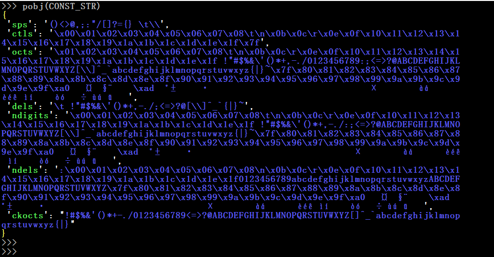
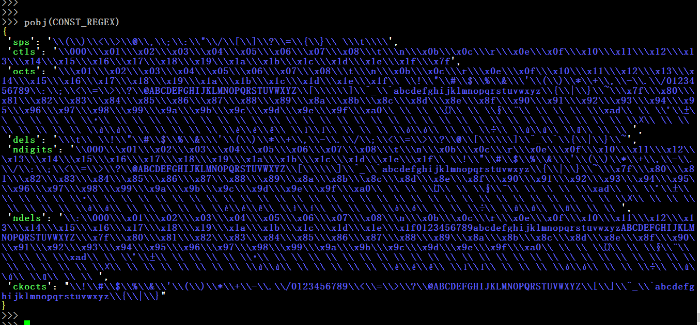

__1. \_real_dollar(s,sre\_match)__  

__2. \_creat\_regex(unescaped\_regex\_str,**kwargs)__

__3. CONST\_STR\_help()__

__4. CONST\_REGEX\_help()__

__5. \_all\_octets\_str()__

__6. \_all\_cookie\_octets\_str()__

__7. \_all\_separators\_str()__

__8. \_all\_delimiters\_str()__

__9. \_all\_non\_digits\_str()__

__10. \_all\_non\_delimiters\_str()__

__11. \_all\_ctls\_str()__

__12. CONST\_STR__

 

__13. CONST\_REGEX__

 

__14. \_isNUL(c)__

__15. \_isOCTET(c)__

__16. \_isWSP(c)__

__17. \_is\_obs\_fold(cc)__

__18. \_isOWS(s)__

__19. \_is\_separators(c)__

