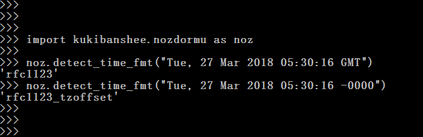
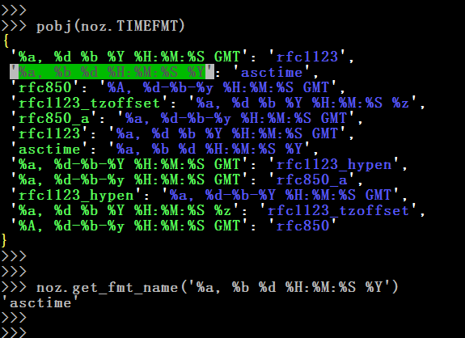
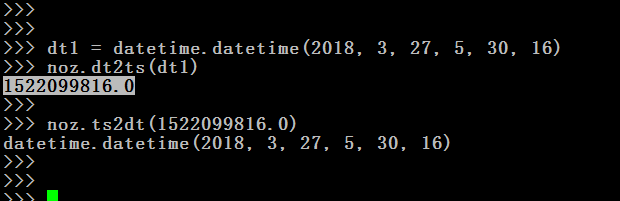
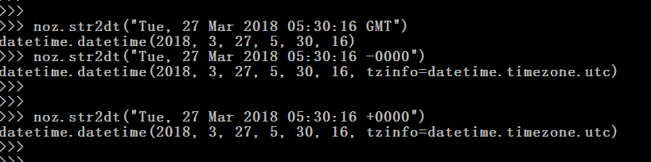
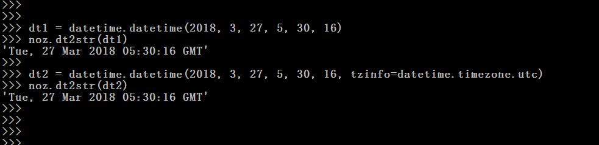
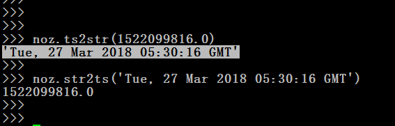

__0. detect_time_fmt(date_value,**kwargs)__  

 

__1. fromat_asc(asc)__  

__2. standlize(s)__  

__3. get_fmt_name(format)__  

 

__4. ts2dt(ts)__  

 

__5. dt2ts(dt,**kwargs)__  

 

__6. str2dt(s,**kwargs)__  

 

__7. dt2str(dt,**kwargs)__  

 

__8. str2ts(s,**kwargs)__  

 

__9. ts2str(ts,**kwargs)__  

 
